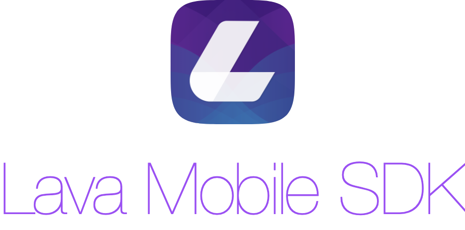
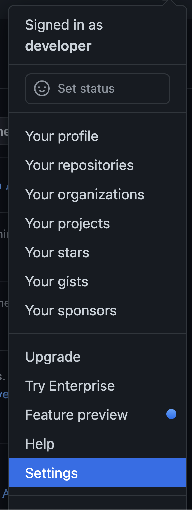
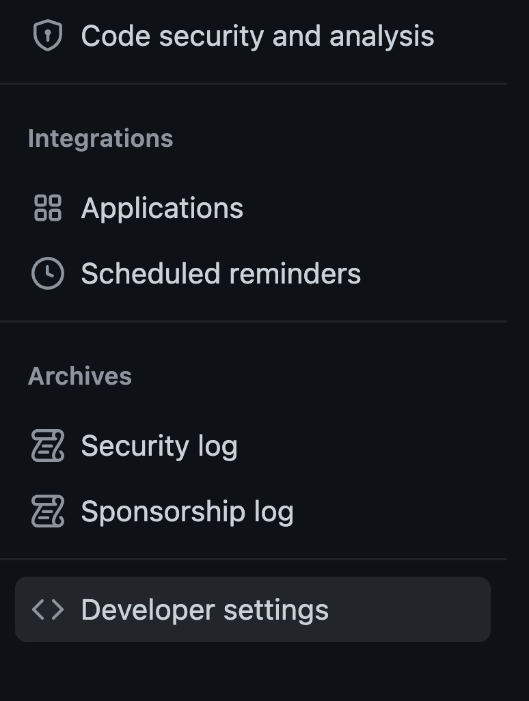
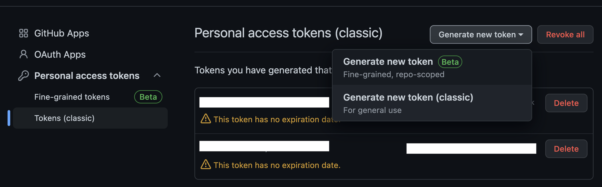
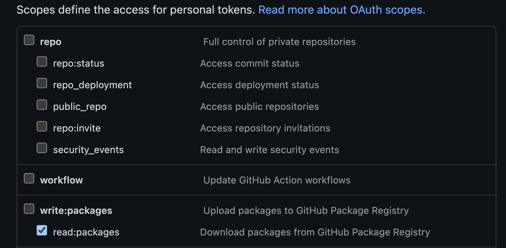

<p align="center">
    
</p>


[](https://img.shields.io/badge/Platforms-Android-green?style=flat-square)

LavaMobileSDK for Android is the client libary to integrate your mobile apps with Lava Platform.

- [Features](#features)
- [Installation](#installation)
  - [Generate Personal Access Token](#generate-personal-access-token)
  - [Set up Android project](#set-up-android-project)
- [Help](#help)


## Features

- Handle push notification from LAVA Platform.
- Message Inbox.
- Membership Pass.
- Deep Links.
- Track Events.

## Installation
This library is hosted on GitHub Packages, in order to install it, you must ask LAVA for granting you the access. After that, please follow the steps below:
1. Generate Personal Access Token.
2. Set up Android project.

### Generate Personal Access Token
After you have the access to the library, you have to generate your Personal Access Token to use with your Android project.

1. On the top right corner, click on your avatar and select `Settings`.

<p align="center">
    
</p>

2. On the left panel, scroll down and select `Developer settings`.

<p align="center">
    
</p>

3. Select `Personal access tokens` > `Tokens (classic)`. Click on `Generate new token` > `Generate new token (classic)`.

<p align="center">
    
</p>


4. Fill the necessary information and in the Scopes section, select only `read:packages`. Submit.

<p align="center">
    
</p>

5. Copy your newly generated Personal Access Token and store it in a secure place. This PAT will be use in the next step as the password.

### Set up Android project
Let's set up your Android project:

1. Create a new file named `project.properties` in your project root. You must add this file into `.gitignore` to not tracking it. Add the following content to the file and replace the placeholders with appropriate values:

```bash
GITHUB_USERNAME=<your GitHub username>
GITHUB_PERSONAL_ACCESS_TOKEN=<your generated Personal Access Token>
```

2. Open your `settings.gradle`, replace the `dependencyResolutionManagement` block with the following content:

```kotlin
def property = new Properties()
file("project.properties").withInputStream { property.load(it) }

dependencyResolutionManagement {
    repositoriesMode.set(RepositoriesMode.FAIL_ON_PROJECT_REPOS)
    repositories {
        google()
        mavenCentral()
        maven {
            url = uri("https://maven.pkg.github.com/lavaai/LavaMobileSDK-Android")
            credentials {
                username = property.get("GITHUB_USERNAME")
                password = property.get("GITHUB_PERSONAL_ACCESS_TOKEN")
            }
        }
    }
}
```

3. In your app level `build.gradle`, add the following dependency and sync the project:

```groovy
implementation 'ai.lava.mobile-sdk:lavasdk:2.0.30'
```

## Help
Please contact LAVA Support in case you need help.


