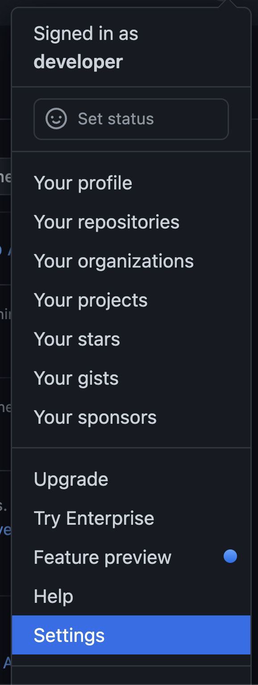
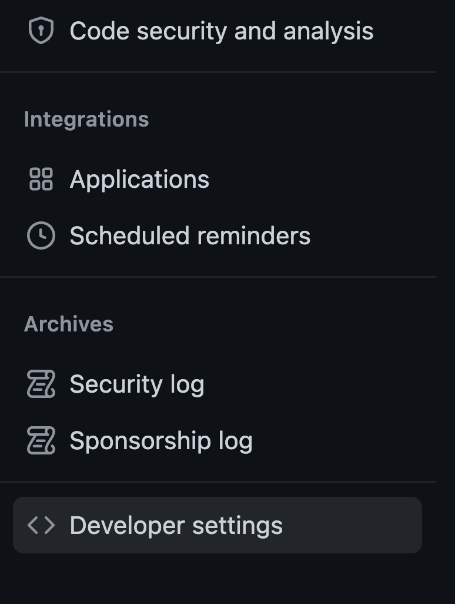
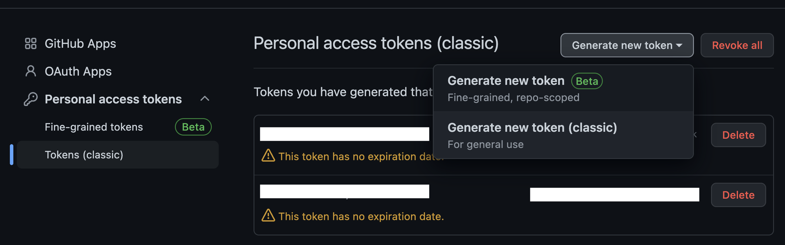
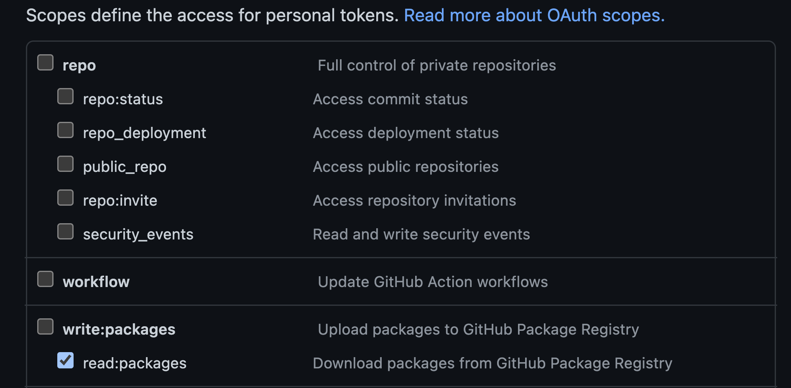
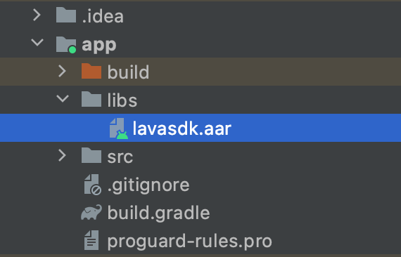

# Getting started

[Integration guide](README.md)

## Overview

The LAVA Mobile SDK is part of the LAVA real-time engagement platform. It supports:

- Personal information consent
- Push notifications from the LAVA platform
- Message inbox
- Membership pass
- Deep links
- Track events

## Requirements

The LAVA Android SDK is available as a `lavasdk.aar` file.

- Minimum SDK version: 23
- Target SDK version: 33
- Android OS versions 8 and later

## Installation

Install the SDK from GitHub Packages, or manually with the provided `.aar` file. GitHub Packages is the preferred method.

### Install from GitHub Packages

1. Make sure you have an active GitHub account. Contact LAVA Support to grant your account access to the library package on GitHub.
2. Create a GitHub personal access token for your Android project. On GitHub, click your avatar in the top right and select **Settings**.

<p align="center">
    
</p>

On the left panel, scroll down and select **Developer settings**.

<p align="center">
    
</p>

Select **Personal access tokens** > **Tokens (classic)**. Click **Generate new token** > **Generate new token (classic)**.

<p align="center">
    
</p>

Fill in the token details. Under **Scopes**, select only `read:packages`, then submit.

<p align="center">
    
</p>

Copy the new personal access token and store it in a secure place. This token is the password in the next step.

3. Create a file named `project.properties` in your project root. Add this file to `.gitignore` so the token is not pushed. Replace the placeholders:

```properties
GITHUB_USERNAME=<your GitHub username>
GITHUB_PERSONAL_ACCESS_TOKEN=<your generated Personal Access Token>
```

4. In `settings.gradle`, replace the `dependencyResolutionManagement` block:

```groovy
def property = new Properties()
file("project.properties").withInputStream { property.load(it) }

dependencyResolutionManagement {
    repositoriesMode.set(RepositoriesMode.FAIL_ON_PROJECT_REPOS)
    repositories {
        google()
        mavenCentral()
        maven {
            url = uri("https://maven.pkg.github.com/lavaai/LavaMobileSDK-Android")
            credentials {
                username = property.get("GITHUB_USERNAME")
                password = property.get("GITHUB_PERSONAL_ACCESS_TOKEN")
            }
        }
    }
}
```

5. In the app-level `build.gradle`, add the dependency and sync the project:

```groovy
implementation 'ai.lava.mobile-sdk:lavasdk:2.0.34'
```

### Install manually

1. Create a `libs` folder in your project directory. Drag `lavasdk.aar` into that directory.

<p align="center">
    
</p>

2. Add this line to the module `build.gradle`:

```groovy
implementation fileTree(dir: "libs", include: ["*.aar"])
```

3. Add these dependencies to the module `build.gradle`, then sync the project:

```groovy
implementation 'com.google.code.gson:gson:2.8.9'
implementation 'com.squareup.retrofit2:retrofit:2.9.0'
implementation 'com.squareup.retrofit2:converter-gson:2.9.0'
implementation 'com.squareup.retrofit2:converter-scalars:2.9.0'
implementation 'com.squareup.okhttp3:okhttp:4.9.0'
implementation 'com.squareup.okhttp3:logging-interceptor:4.9.0'
implementation 'com.squareup.okio:okio:2.8.0'
implementation 'com.auth0.android:jwtdecode:2.0.1'
implementation 'androidx.browser:browser:1.8.0'
```

## Configure and initialize

Initialize the SDK with the values provided by LAVA:

```kotlin
fun init(
    application: Application,
    appKey: String,
    clientId: String,
    smallIcon: String,
    logLevel: LavaLogLevel = LavaLogLevel.WARN
)
```

`logLevel` is the level written to logcat. Leave logging enabled so the integration can be troubleshot.

> **Note**
>
> This `init()` call assumes full consent for personal information. To customize the consent list, see [Personal information consent](consent.md).

**Usage**

```kotlin
Lava.init(
    this,
    "LAVA_APP_KEY",
    "LAVA_CLIENT_ID",
    R.drawable.app_icon_shil.toString(),
    LavaLogLevel.VERBOSE
)
```

The full parameter list is in [Initialization](initialization.md).

## General usage

The main SDK APIs are on the `Lava` singleton. For example:

```kotlin
Lava.instance.fetchDebugData()
```

## Backward compatibility

The SDK uses classes that require Android SDK 26+ and Java 8+. On older Android versions that can crash. To support a minimum SDK of 23, enable desugaring:

1. Update the Android Gradle plugin to 4.0.0 or above.
2. Update the app module `build.gradle`:

```groovy
android {
    defaultConfig {
        // Required when setting minSdkVersion to 20 or lower
        multiDexEnabled true
    }

    compileOptions {
        // Flag to enable support for the new language APIs
        coreLibraryDesugaringEnabled true
        // Sets Java compatibility to Java 8
        sourceCompatibility JavaVersion.VERSION_1_8
        targetCompatibility JavaVersion.VERSION_1_8
    }
}

dependencies {
    coreLibraryDesugaring 'com.android.tools:desugar_jdk_libs:1.1.5'
}
```

See the [Android Java 8+ API desugaring guide](https://developer.android.com/studio/write/java8-support#library-desugaring).

---

[Integration guide](README.md) · [Previous: Change log](changelog.md) · [Next: Initialization](initialization.md)
