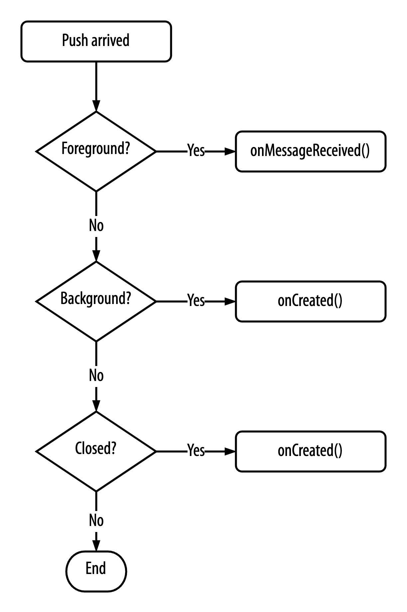
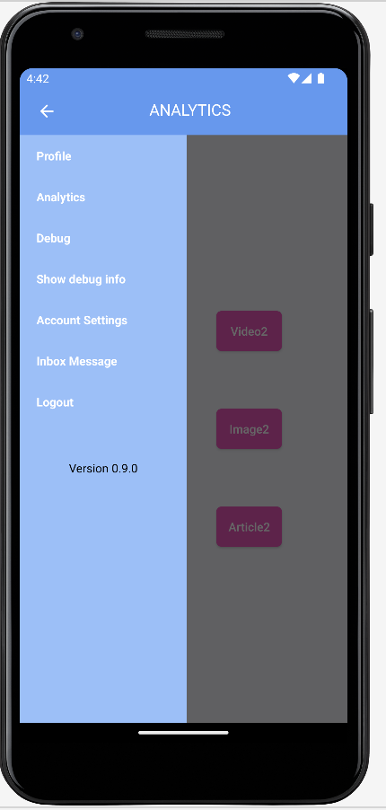

# Push notifications

[Integration guide](README.md)

## Register a notification token

| Personal information consent | Collected data |
| --- | --- |
| Strictly Necessary, Functional | Access token, secure member token, notification token |

Register the app for LAVA push notifications from your `Application` subclass:

```kotlin
fun setNotificationToken(token: String?)
```

**Usage**

```kotlin
FirebaseMessaging.getInstance().token.addOnSuccessListener { token: String ->
    Lava.instance.setNotificationToken(token)
}
```

## Handle an incoming push notification

| Personal information consent | Collected data |
| --- | --- |
| Strictly Necessary | Access token, secure member token, notification token |

```kotlin
fun <T : Activity> handleNotification(
    ctx: Context,
    hostActivity: Class<T>,
    data: Map<String, String>,
    Callback: ResultListener? = null,
    hostActivityBundle: Bundle? = null
): Boolean
```

The app must cover three states for notifications to appear:

1. **Foreground:** at least one screen of the app is active.
2. **Background:** no screen is active, but the process is still running.
3. **Closed:** the app has been terminated.

<p align="center">
    
</p>

Call `handleNotification()` in two places:

1. `onMessageReceived()` in a `FirebaseMessagingService` subclass, described below.
2. `onCreate()` of the launcher activity, for the case where the user taps a notification while the app is in the background or closed.

Declare the Firebase service:

```xml
<service
    android:name=".notification.MyFcmMessageService"
    android:exported="false">
    <intent-filter>
        <action android:name="com.google.firebase.MESSAGING_EVENT" />
    </intent-filter>
</service>
```

**Usage**

In the `FirebaseMessagingService` subclass:

```kotlin
class MyFcmMessageService : FirebaseMessagingService() {
    override fun onMessageReceived(remoteMessage: RemoteMessage) {
        super.onMessageReceived(remoteMessage)

        val data = remoteMessage.data
        if (data.isNotEmpty()) {
            if (Lava.instance.handleNotification(
                    applicationContext,
                    MainActivity::class.java,
                    data
                )
            ) {
                // Notification handled by the Lava SDK. The host app can ignore it.
            } else {
                // The host app should handle the notification.
            }
        }
    }
}
```

In the launcher activity:

```kotlin
override fun onCreate(savedInstanceState: Bundle?) {
    super.onCreate(savedInstanceState)

    val intentExtras = intent.extras

    if (intentExtras != null) {
        val intentExtrasMap = mutableMapOf<String, String>()

        intentExtras.keySet()?.forEach { key ->
            intentExtrasMap[key] = intentExtras.getString(key) ?: "null"
        }

        if (Lava.instance.canHandlePushNotification(intentExtrasMap)) {
            val handleNotificationResult = Lava.instance.handleNotification(
                applicationContext,
                MainActivity::class.java,
                intentExtrasMap,
                null,
                intentExtras
            )
            if (!handleNotificationResult) {
                Log.e("LAVAPushNotification", "Lava handleNotification failed")
            }
        }
    }
}
```

The SDK only handles push notifications that come from LAVA. The return value says whether the SDK consumed the notification. If it is `false`, the app should handle it.

## App state for a push notification in the background

When a notification arrives while the app is in the background, show it on top of the screen the user had open. In the Lava demo app, the user can open Analytics from the menu. A later push should overlay Analytics, not the default Profile screen.

<p align="center">
    
</p>

Build an extra `Bundle` in the FCM service and pass it to `handleNotification`:

```kotlin
class MyFcmMessageService : FirebaseMessagingService() {
    override fun onMessageReceived(remoteMessage: RemoteMessage) {
        super.onMessageReceived(remoteMessage)

        val data = remoteMessage.data
        if (data.isNotEmpty()) {
            val mainActivityStateBundle = Bundle()
            mainActivityStateBundle.putInt(
                "prevClickedId",
                MainActivity.prevClickedId
            )
            if (Lava.instance.handleNotification(
                    applicationContext,
                    MainActivity::class.java,
                    data,
                    null,
                    mainActivityStateBundle
                )
            ) {
                // Notification handled by the Lava SDK. The host app can ignore it.
            } else {
                // The host app should handle the notification.
            }
        }
    }
}
```

Restore that state from the intent extras in the activity `onCreate`:

```kotlin
override fun onCreate(savedInstanceState: Bundle?) {
    super.onCreate(savedInstanceState)

    val prevClickedIdFromBundle = intent.getIntExtra("prevClickedId", -1)
    if (prevClickedIdFromBundle != -1) {
        // Start the UI with the selected view
    } else {
        // Start the UI with the default view
    }
}
```

## Check if a push notification can be handled by Lava

| Personal information consent | Collected data |
| --- | --- |
| Strictly Necessary | Access token |

Use `canHandlePushNotification` when the app, or another library, handles some notifications itself.

```kotlin
fun canHandlePushNotification(
    pushNotificationData: Map<String, String>
): Boolean
```

**Usage**

```kotlin
class MyFcmMessageService : FirebaseMessagingService() {
    override fun onMessageReceived(remoteMessage: RemoteMessage) {
        super.onMessageReceived(remoteMessage)

        val data = remoteMessage.data
        if (data.isNotEmpty()) {
            if (Lava.instance.canHandlePushNotification(data)) {
                if (!Lava.instance.handleNotification(
                        applicationContext,
                        MainActivity::class.java,
                        data
                    )
                ) {
                    // Lava failed to handle the notification
                }
            } else {
                // The host app should handle the notification
            }
        }
    }
}
```

## Deep linking from push notifications

| Personal information consent | Collected data |
| --- | --- |
| Strictly Necessary | Access token |

LAVA push notifications can carry a deep link. Implement a `BroadcastReceiver` and register it with the SDK:

```kotlin
fun registerDeepLinkReceiver(deepLinkReceiver: Class<*>?)
```

**Usage**

```kotlin
Lava.instance.registerDeepLinkReceiver(DeepLinkReceiver::class.java)
```

```kotlin
class DeepLinkReceiver : BroadcastReceiver() {
    override fun onReceive(context: Context, intent: Intent) {
        val url = intent.getStringExtra(LavaConstants.DeepLink.URL)

        if (Lava.instance.handlePassLink(context, url!!)) {
            // LAVA SDK successfully handles the deep link
        }
    }
}
```

## Customize the push notification UI

| Personal information consent | Collected data |
| --- | --- |
| Strictly Necessary | Access token |

The SDK uses a basic notification style unless you set your own:

```kotlin
fun setCustomStyle(customStyle: Style)
```

**Usage**

```kotlin
val customStyle = Style()
    .setTitleFont(Typeface.DEFAULT)
    .setContentFont(Typeface.DEFAULT)
    .setBackgroundColor(Color.BLACK)
    .setTitleTextColor(Color.GREEN)
    .setContentTextColor(Color.LTGRAY)
    .setCloseImage(R.drawable.test_close)

Lava.instance.setCustomStyle(customStyle)
```

---

[Integration guide](README.md) · [Previous: Authentication and profile](authentication.md) · [Next: Message inbox](message-inbox.md)
