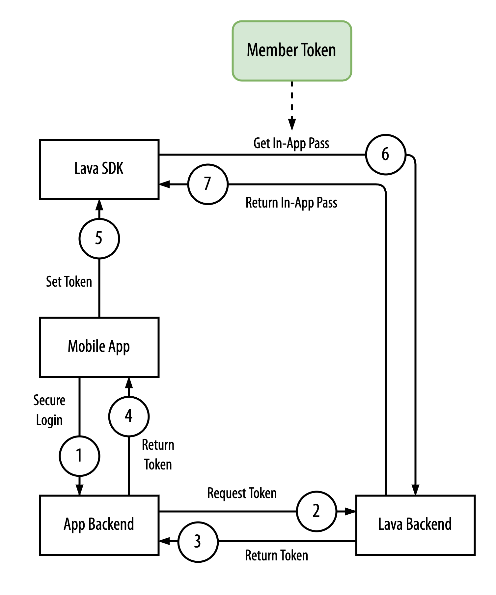
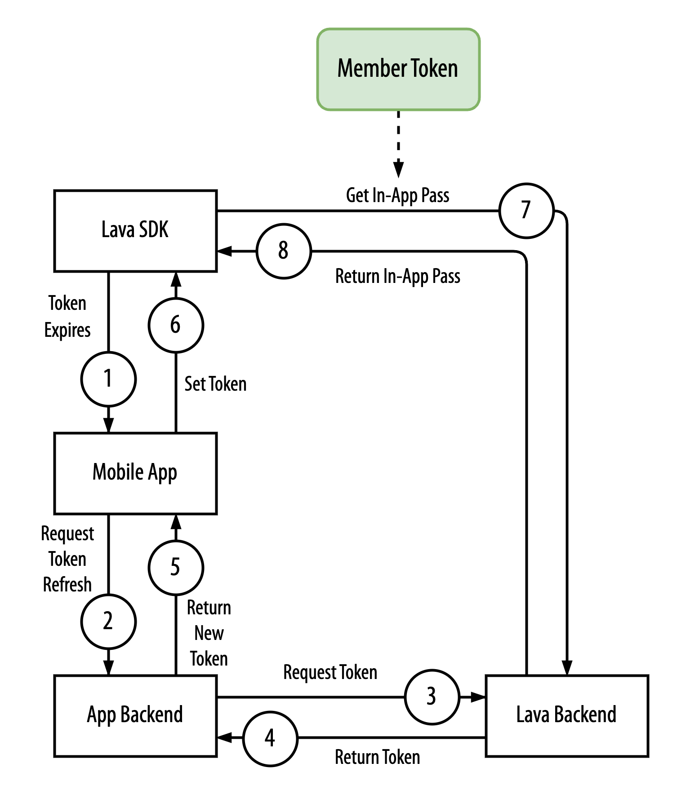

# Secure token

[Integration guide](README.md)

A secure member token protects sensitive personal data. The app backend generates it. The mobile app and the app backend can cache and refresh it independently of the Lava SDK.

The diagram below is the usual path for showing the in-app pass.

<p align="center">
    
</p>

1. The mobile app sends a login request to the app backend.
2. The app backend requests a member token from the Lava backend.
3. The Lava backend returns a secure member token.
4. The app backend returns that token in the login response.
5. The mobile app sets the member token on the Lava SDK.
6. When the SDK needs to display the in-app pass, it sends the member token to the Lava backend.
7. The Lava backend returns the in-app pass.

## Refresh token

The secure token expires. After that, the mobile app and the app backend refresh it:

<p align="center">
    
</p>

1. The Lava SDK sends an expiry event to the mobile app.
2. The mobile app asks the app backend for a new token.
3. The app backend requests a new token from the Lava backend.
4. The Lava backend returns a new token to the app backend.
5. The app backend returns the new token to the mobile app.
6. The mobile app sets the new token on the Lava SDK.
7. When the mobile app needs to show the in-app pass, the Lava SDK uses the token to call the Lava backend.
8. The Lava backend returns the content.

## App backend

The app backend must authenticate the user. It calls the Lava backend when the mobile app needs a secure token, for example during login.

| | |
| --- | --- |
| Method | `POST` |
| Host | `https://<client-subdomain>-membership.lava.ai` |
| Endpoint | `/api/v1/token` |
| Header | `Authorization: Bearer <Integration Token>` |
| Content-Type | `application/json` |
| Payload | `{ "userId": <user identity> }` |
| Response | `{ "token": <member token> }` |

LAVA Customer Support provides the integration token.

After the app backend receives the secure token, it sends the token back to the mobile app for the SDK.

## Set the secure member token

| Personal information consent | Collected data |
| --- | --- |
| Strictly Necessary | Secure member token |

When the mobile app receives the token from the app backend, set it on the SDK before the calls that need it:

```kotlin
fun setSecureMemberToken(token: String)
```

**Usage**

```kotlin
Lava.instance.setSecureMemberToken(secureMemberToken)
```

## Subscribe for the token expiry event

| Personal information consent | Collected data |
| --- | --- |
| Strictly Necessary | Secure member token |

Subscribe so the app is told when the secure token expires:

```kotlin
fun subscribeSecureMemberTokenExpiry(listener: SecureMemberTokenExpiryListener)
```

```kotlin
interface SecureMemberTokenExpiryListener {
    fun onExpire(onSuccess: () -> Unit, onError: (Throwable) -> Unit)
}
```

Have the `Application` class implement this interface. In `onExpire()`, ask the app backend to renew the secure token.

**Usage**

```kotlin
class MyApplication : Application(), SecureMemberTokenExpiryListener {
    override fun onCreate() {
        super.onCreate()
        Lava.instance.subscribeSecureMemberTokenExpiry(this)
    }

    override fun onExpire(onSuccess: () -> Unit, onError: (Throwable) -> Unit) {
        val sp = AppSession.appPreference(this)
        val email = AppSession.getEmail(sp)
        email?.let {
            val body = RefreshTokenRequest(it)
            RestClient.refreshToken(body, object : ApiResultListener {
                override fun onResult(
                    success: Boolean,
                    authResponse: AuthResponse?,
                    errorMessage: String?
                ) {
                    if (!success) {
                        onError(Error("Not successful"))
                        return
                    }

                    authResponse?.memberToken?.let { token ->
                        Lava.instance.setSecureMemberToken(token)
                    }

                    onSuccess()
                }
            })
        }
    }
}
```

## Unsubscribe from the token expiry event

| Personal information consent | Collected data |
| --- | --- |
| Strictly Necessary | Secure member token |

```kotlin
fun unsubscribeSecureMemberTokenExpiry(listener: SecureMemberTokenExpiryListener)
```

**Usage**

```kotlin
override fun onTerminate() {
    super.onTerminate()
    Lava.instance.unsubscribeSecureMemberTokenExpiry(this)
}
```

Call this when the app no longer needs expiry events.

---

[Integration guide](README.md) · [Previous: Track](track.md) · [Next: Pass](pass.md)
